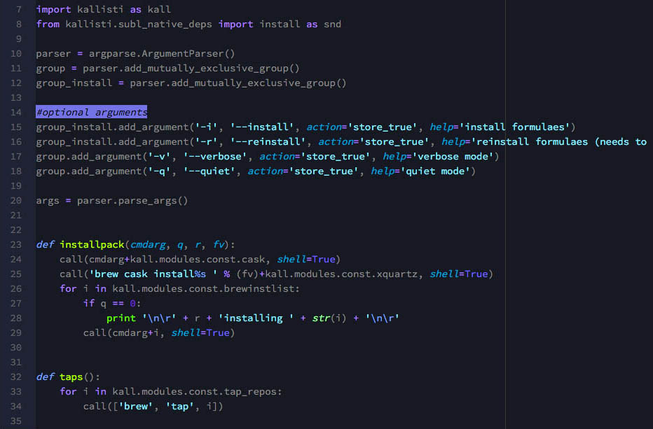
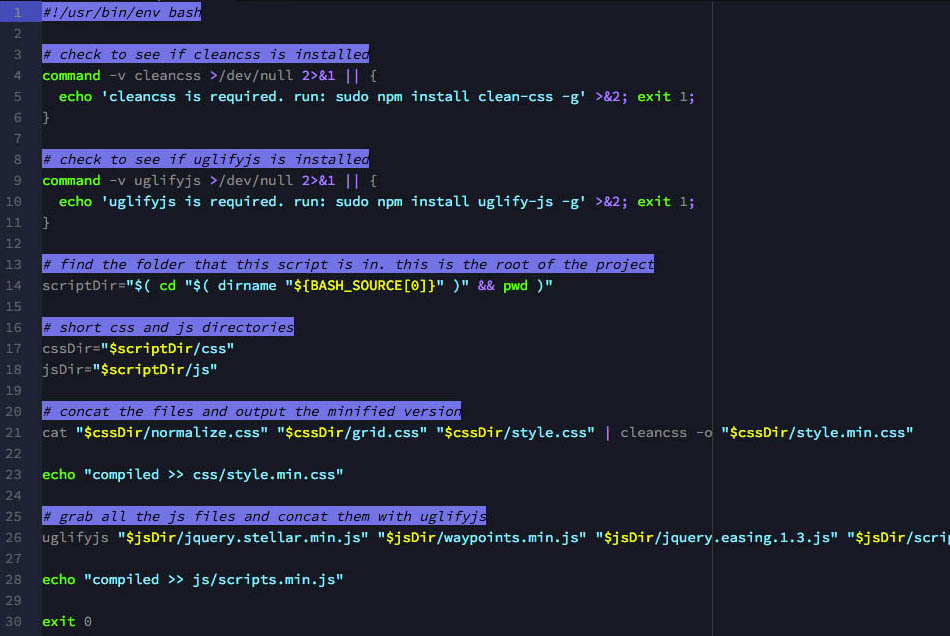
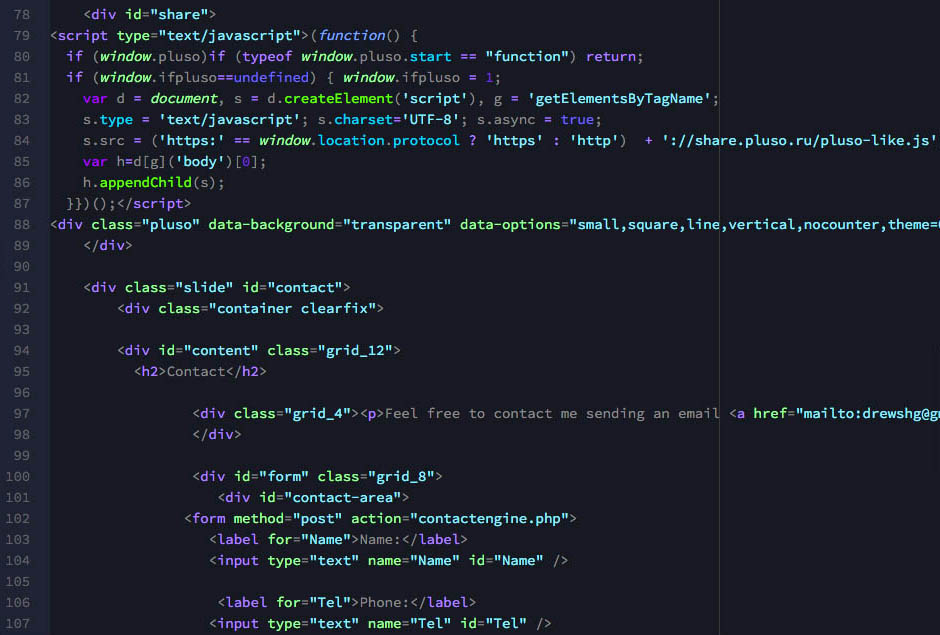

# sublime-singing-stars

High contrast dark theme for Sublime Editor.

Installation:
```
git clone https://github.com/Drewshg312/sublime-singing-stars.git
cp sublime-singing-stars/SingingStars.tmTheme ~/Library/Application\ Support/Sublime\ Text\ 2/Packages/Color\ Scheme\ -\ Default/
```

## Python:



## Bash:



## HTML:



Author Information
------------------

Andrew Shagayev | [e-mail](mailto:drewshg@gmail.com)

